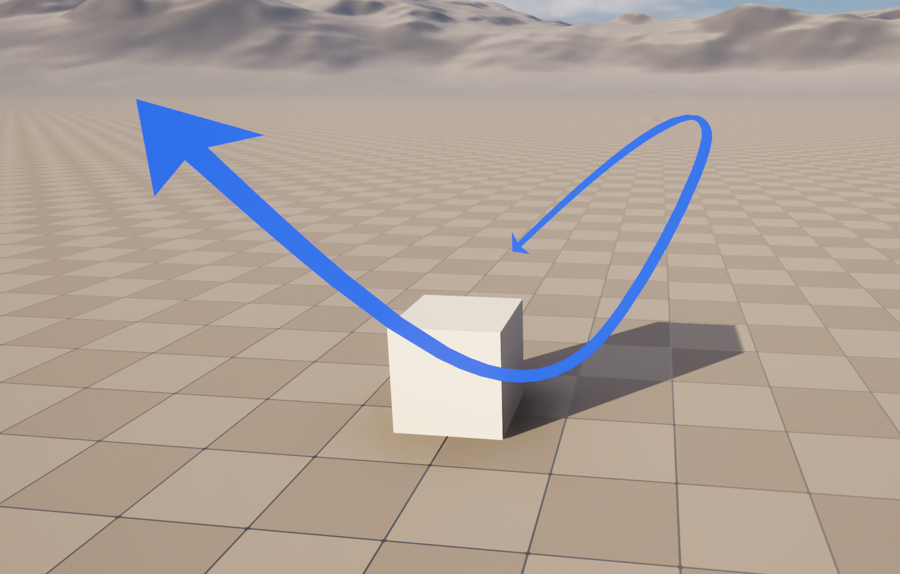
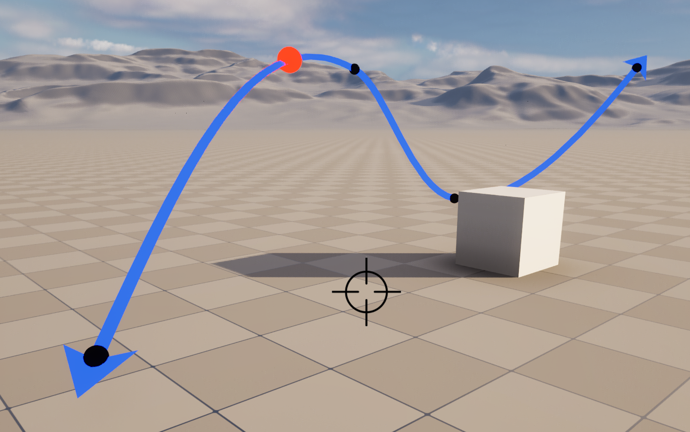
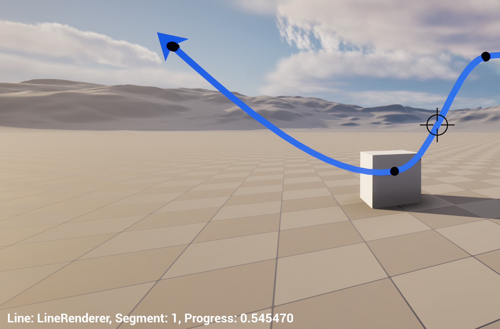
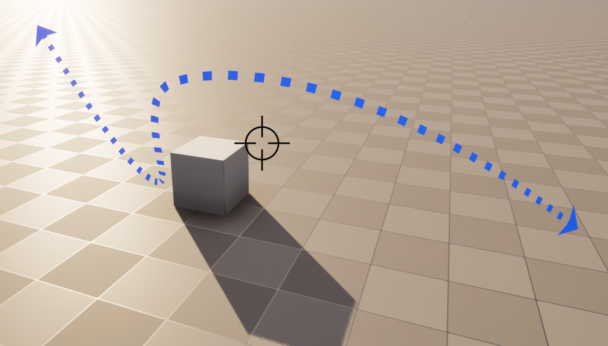
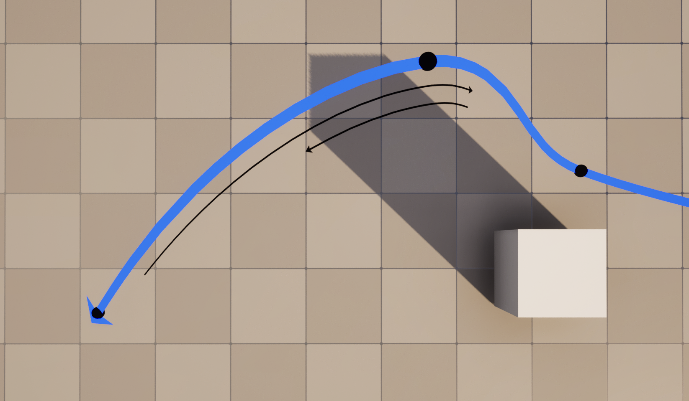

# Unreal Engine Line/Spline Renderer

Unity has a 2D line renderer. Now Unreal Engine has one too, along with a spline tessellator, hit detector, and other features.

This line renderer was written as part of porting the app Shot Designer 3D from Unity to Unreal Engine (in current development by www.hollywoodcamerawork.com). Since there are few or no 2D line renderers for Unreal Engine, we're making it open source with a permissive license. Hopefully it helps someone!

# Features

- Smooth spline or simple line.
- Automatic tangents draws a smooth line through points.
- Spline is tessellated with a quality setting.
- Geometry is created using UProceduralMesh.
- Geometry automatically orients towards camera or custom Up vector.
- Hard corners on line maintain mass.
- Selectable arrowheads.
- Rendered control points.
- Hit detector that detects control points or point on spline from screen coordinates.
- Multiple styles, such as dotted or dashed lines, or animated materials.
- Efficient update cycle that recalculates as little as possible.
- Configurable line width and arrowhead size.
- Animation functions for getting linear movement along spline.
- Shot Designer-specific feature to draw lines next to main line to illustrate camera movement. Just ignore.

# Examples

*Image of control points, and an animated red ball moving at constant speed along spline:*

&nbsp; 

*Image of hit detector locating the point 54% along segment 1:*

&nbsp; 

*Image of dotted line material being used:*

&nbsp; 

*Image of "sidelines", a Shot Designer-specific feature for showing camera movement:*

# How To Use

The code is extracted from the Shot Designer 3D project, and maintains some file structure.
- The main code is in Source/LineRenderer/Graphics/LineRenderer.
- Some utility functions are dragged along in Source/LineRenderer/Util.
- Materials are in Content/Graphics/LineRenderer.

You simply drop an ALineRenderer actor into the scene, and configure some bezier points. Settings are self-explanatory. Camera orientation doesn't start until the app is playing.

To test hit detection and animation, add a ALineRendererTester to the scene.

* The hit detector scrapes the scene for line renderers, which is inefficient. If you also drew the lines programatically, it's better to iterate the list you have. But the code example shows how to use the hit detector, and find the best match among multiple lines.

# What's Next?

If anyone wants to develop this into a more fully featured, general and blueprintable line/spline renderer, make yourself heard. We already have what we need, and any changes we make from now on are probably increasingly custom.

But since a lightweight 2D line/spline renderer doesn't exist for Unreal (every one we've seen extrudes actual 3D objects along splines and are heavy). Contributors are welcome.
